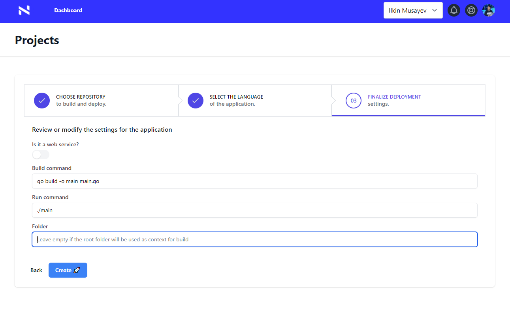

# NativeCI demos

This repository contains various quickstart demos that you can immediately start using without any installs.

Simply fork the repository to your account and when creating a new project in NativeCI (https://console.nativeci.io/add-project):

Specify the demo you want to run as folder, like go-telegram-bot or go-fullstack.

