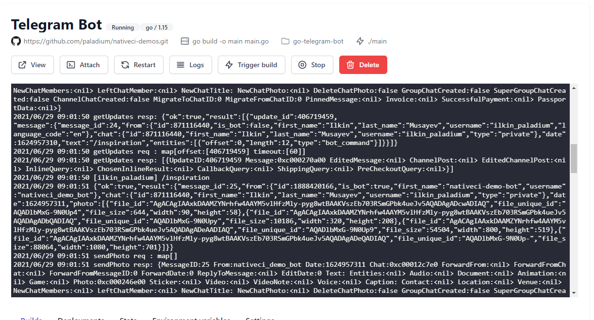

# Go telegram bot demo

This demo runs a simple telegram bot with a single command ```/inspiration``` to get a random photo for inspiration from Unsplash.

To run the demo on your account, first fork the project. Next navigate to https://console.nativeci.io and click create project.

Choose the nativeci-demos repository and golang on the next step (1.15 version). Finally on the final page, make sure that ```Is it web service``` is unchecked (since it will be running in background to listen for telegram messages) and specify the folder: ```go-telegram-bot```.

Next obtain a new token from @BotFather and navigate to your NativeCI project afterwards. Click on environment variables and add a new one:
```
TELEGRAM_TOKEN: <token_obtained_from_bot_father>
```
Finally click trigger build to deploy a new version of the application.

You can now extend this bot however you like and after you commit the changes the github, the new version will be deployed within 1 minute. Good luck 😉



Give a bot a try at: https://t.me/nativeci_demo_bot